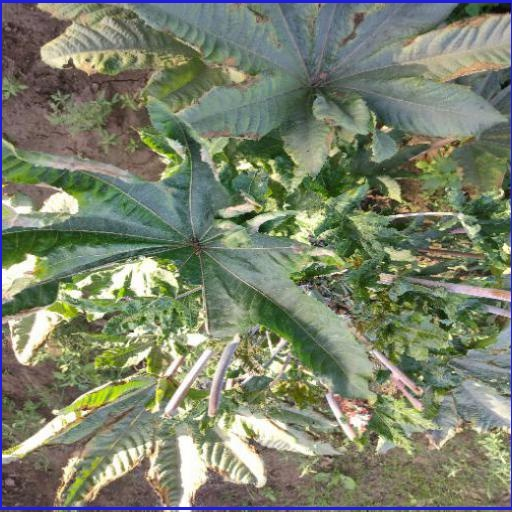
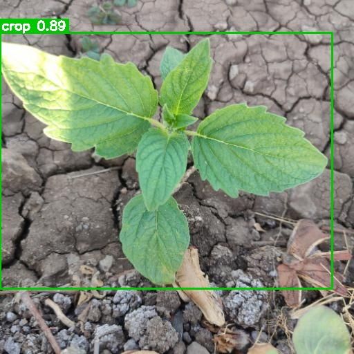
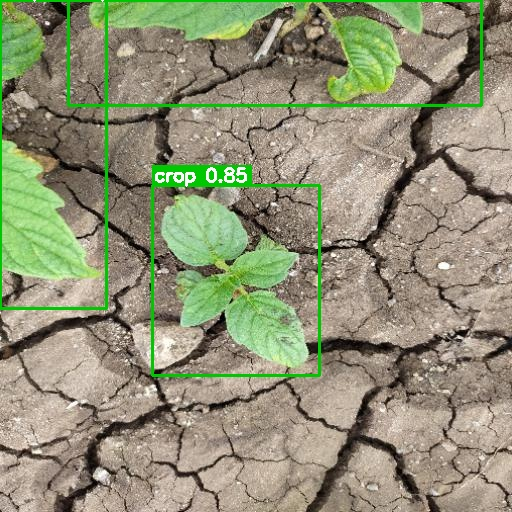
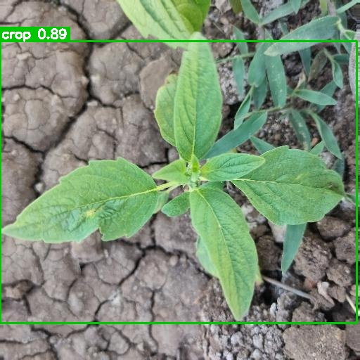
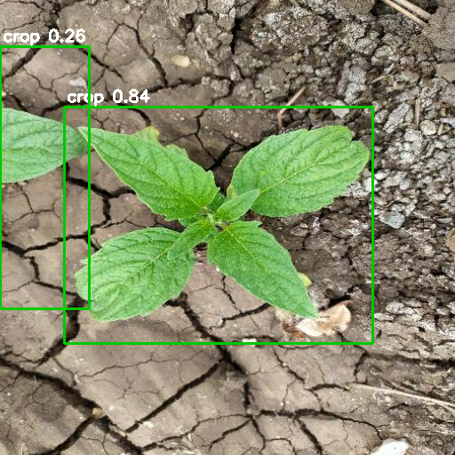

# 🌱 AgroVision-Edge — Detección de malezas en cultivos (edge)

Sistema de **detección de cultivo vs maleza** con visión por computadora (YOLO), diseñado para **correr en dispositivo edge** (NVIDIA Jetson) sin conexión a internet ni GPU de datacenter. El modelo debe decidir en el dispositivo, en tiempo real, directamente sobre la maquinaria agrícola.

> **TL;DR (30 s):** se entrenó un YOLOv8n que distingue cultivo de maleza con mAP50 = 0.904; se exportó a ONNX y se cuantizó a INT8, reduciendo el tamaño **de 6.25 a 3.60 MB (−42%)** con apenas 1.84 pts de mAP perdidas; el pipeline completo (entrenamiento → export → cuantización → benchmark → demo) queda corrible y documentado.

## Por qué edge importa

La aplicación selectiva de agroquímicos en el campo — pulverizadores inteligentes con detección on-device que deciden dónde aplicar y dónde no — ocurre en **zonas sin conectividad confiable**. Subir cada frame a la nube para inferir no es viable: latencia, costo de datos y dependencia de cobertura fallan en el campo real. El modelo debe vivir en el equipo: **<200 ms por frame, <10–15 MB de peso, idealmente cuantizado a INT8**, sin round-trip a la nube.

Por eso el foco de este proyecto **no es solo "detectar objetos"** sino construir y documentar el **trade-off precisión / tamaño / latencia** que habilita la inferencia on-device con restricciones reales.

## Dataset

Fuente: [Crop and Weed Detection Data with Bounding Boxes](https://www.kaggle.com/datasets/ravirajsinh45/crop-and-weed-detection-data-with-bounding-boxes) (Kaggle, `ravirajsinh45`) — **1300 imágenes de cultivo de sésamo** con malezas, anotadas en formato YOLO.

El dataset corresponde a **sésamo**, no a soja ni maíz. Se usa como prueba de concepto; el pipeline (descarga, split, entrenamiento, export, cuantización, benchmark, demo) está construido **dataset-agnostic** (las clases se leen de `data/raw/classes.txt`), por lo que se puede reemplazar por un dataset de cualquier otro cultivo sin reescribir el código.

## Estado del proyecto

- [x] **Fase 1** — Setup + EDA + split 80/10/10 estratificado ✓
- [x] **Fase 2** — Baseline: YOLOv8n @ 640 + class weights, 30 épocas (mAP50=0.904, 6.0 MB) ✓
- [x] **Fase 3** — Optimización edge: export ONNX FP32 + PTQ INT8 ✓
- [x] **Fase 4** — Benchmark de inferencia: latencia por frame (CPU + edge simulado) ✓
- [x] **Fase 5** — Demo: CLI (imagen/video) + app Streamlit ✓
- [x] **Fase 6** — Documentación final ✓

## Resultados (tabla final consolidada — Fase 4)

Medición de latencia sobre split `test` (131 frames, 3 iteraciones, warmup 5). Tres formatos del mismo modelo, dos modos (`full` = todos los threads del hardware de desarrollo; `edge` = threads acotados a 2 como aproximación al régimen edge). Ver `reports/benchmark/benchmark.md`.

| modelo | formato | tamaño (MB) | mAP50 | mAP50-95 | modo | lat. mean (ms) | p95 (ms) | FPS |
|---|---|---|---|---|---|---|---|---|
| baseline | `.pt` FP32 | 6.25 | **0.9034** | **0.6093** | full (12 th) | 41.6 | 46.2 | **24.0** |
| baseline | `.pt` FP32 | 6.25 | 0.9034 | 0.6093 | edge (2 th)  | 40.3 | 43.1 | 24.8 |
| baseline | `.onnx` FP32 | 12.37 | 0.9034 | 0.6093 | full | 75.8 | 103.4 | 13.2 |
| baseline | `.onnx` FP32 | 12.37 | 0.9034 | 0.6093 | edge | 74.5 | 101.6 | 13.4 |
| baseline | `.onnx` INT8 (PTQ) | **3.60** | 0.8850 | 0.5956 | full | 86.2 | 120.1 | 11.6 |
| baseline | `.onnx` INT8 (PTQ) | **3.60** | 0.8850 | 0.5956 | edge | 86.7 | 117.9 | 11.5 |

**Lectura de los resultados:**
- **Cuantización INT8 vale para tamaño/portabilidad, no para latencia en CPU x86:** ONNX Runtime en desktop no acelera la inferencia respecto a PyTorch nativo (incluso INT8 es levemente más lento). La ventaja de INT8 aparece en hardware edge con soporte nativo (Jetson/TensorRT, ARM NEON, NPU), no en CPU desktop. El cuantizado acá gana en **tamaño** (3.6 vs 12.4 MB) y **porteabilidad edge**.
- **`full` vs `edge` casi idénticos:** a batch=1 estos modelos chicos no son CPU-bound; el cuello es acceso a memoria + overhead del runtime. Limitar threads sirve de proxy pero no reproduce fielmente un Jetson.

## Decisiones clave

Cada `[DECISIÓN]` del plan con su justificación de una línea:

| # | Decisión | Justificación |
|---|---|---|
| **1.3** | Granularidad **binaria** `crop`/`weed` | El dataset no expone sub-clases de malezas; única opción realista. |
| **1.4** | Split **80/10/10** estratificado por imagen (crop/weed/both) | Estándar para datasets chicos (~1300 imgs); balance simple de reportar. |
| **1.5** | Desbalance: **class weights** (`cls_pw=0.7`) en la loss | Desbalance leve (1.41:1) — no toca el dataset físico; amortigua sin sobreponderar. |
| **2.1** | Arquitectura **YOLOv8n** | Más madura, docs y ecosistema de export ONNX/TensorRT más probados que v11n. |
| **2.2** | Resolución **640×640** | Techo de referencia; el EDA mostró 98.6% de boxes grandes → bajar reso impacta poco (no se probó variantes por foco en edge-size). |
| **2.6** | Augmentation **default de Ultralytics** | Ya tuneado para casos generales; el dataset es de condiciones controladas, no hay data de campo para validar tuning a campo. |
| **3.1** | Target de diseño **NVIDIA Jetson (Orin)** | Caso real de producción edge; sin hardware físico → benchmark en CPU edge-simulado y TensorRT queda como TODO. |
| **3.3** | Cuantización **PTQ INT8** sobre ONNX | Post-training: simple y rápido; PTQ perdió <2 pts de mAP → no se justifica QAT. |
| **3.4** | **Sin pruning** | La cuantización es técnica sólida y suficiente para el alcance; pruning suma tiempo sin mover la aguja. |
| **5.2** | Demo soporta **imagen + video** | El plan lo condicionaba al coste; el pseudovideo del dataset cae con honestidad y activa un demo en vivo más impresionante. |

## Demo (Fase 5)

### App Streamlit

```bash
streamlit run app/streamlit_app.py
# si aparece segfault o warning "torch.classes" en consola, desactivá el watcher:
streamlit run app/streamlit_app.py --server.fileWatcherType none
```

Selector de modelo (`.pt` / `.onnx` FP32 / `.onnx` INT8), sliders de confianza / IoU / `imgsz` con tooltips, métricas del modelo leídas de `reports/` (mAP, tamaño, latencia), tabs Imagen/Video, resumen por clase, distribución de latencia (min/mediana/p95/max), descarga de CSV y del video anotado.

### CLI standalone (`src/inference.py`)

```bash
# carpeta de imágenes -> imgs annotated + CSV
python src/inference.py --source data/processed/images/test --model models/baseline_best.pt

# video -> video annotated + CSV de frames
python src/inference.py --source demo/demo_input.mp4 --model models/baseline_int8.onnx

# una sola imagen
python src/inference.py --source una_imagen.jpg --conf 0.35
```

Outputs en `demo/out/` (o `--out`): imágenes/video con boxes dibujados + `detections.csv`.

### Video demo (frames del dataset)

`src/make_demo_video.py` arma un `.mp4` con N imágenes del split `test` concatenadas para demostrar el pipeline end-to-end (captura continua → detección → CSV). Los frames provienen del propio dataset (mismo dominio que el entrenamiento), por lo que **no representa rendimiento en campo real**; solo demuestra el funcionamiento del pipeline.

```bash
python src/make_demo_video.py --n 30 --fps 10 --repeat 2   # -> demo/demo_input.mp4
python src/inference.py --source demo/demo_input.mp4 --model models/baseline_int8.onnx
```

### Capturas del demo

**Detección sobre imagen estática (CLI):**

| | | |
|---|---|---|
|  |  |  |
|  |  | |

## Estructura del repo

```
weed-detection/
├── README.md
├── plan.md                  # brief del proyecto
├── requirements.txt
├── .gitignore
├── .streamlit/config.toml   # theme verde + config
├── data/
│   ├── raw/                 # dataset original (no versionado, .gitignore)
│   └── processed/           # splits train/val/test + data.yaml (no versionado)
├── notebooks/
│   ├── 01_eda.ipynb         # EDA (sin outputs commiteados; regenerable)
│   ├── build_eda.py         # genera la notebook de EDA
│   └── figures/             # figuras versionadas del EDA
├── src/
│   ├── download_dataset.py  # descarga del dataset desde Kaggle (Fase 1)
│   ├── make_splits.py       # split 80/10/10 estratificado + data.yaml (Fase 1)
│   ├── train.py             # entrenamiento (Fase 2)
│   ├── export.py            # exportación a ONNX FP32 + INT8 PTQ (Fase 3)
│   ├── validate_onnx.py     # validación de mAP + tabla comparativa (Fase 3)
│   ├── benchmark.py         # latencia por frame + tabla final (Fase 4)
│   ├── make_demo_video.py   # arma video demo desde frames del dataset (Fase 5)
│   └── inference.py         # inferencia CLI: imagen o video (Fase 5)
├── app/
│   └── streamlit_app.py     # demo visual (imagen + video) (Fase 5)
├── reports/                 # métricas, curvas y tablas versionadas
│   ├── baseline/            # entrenamiento
│   ├── optimization/        # tabla FP32 vs INT8
│   ├── benchmark/           # latencia por frame
│   └── samples/             # capturas del demo
└── models/                  # pesos .pt/.onnx (no versionado, .gitignore)
```

## Setup

### 1. Entorno (conda, Python 3.10)

```bash
conda create -n agrovision python=3.10 -y
conda activate agrovision
pip install -r requirements.txt
```

### 2. Dataset (Kaggle)

Se necesita una cuenta de Kaggle:

1. Ir a https://www.kaggle.com/settings → *API* → **Create New Token** (descarga `kaggle.json`).
2. Ubicarlo en `~/.kaggle/kaggle.json`.
3. Descargar el dataset:

```bash
python src/download_dataset.py                  # descarga y descomprime en data/raw/
python src/download_dataset.py --overwrite     # re-descarga si ya existe
```

Alternativa manual: descargar el zip desde la página de Kaggle y descomprimirlo en `data/raw/`.

## Reproducir el pipeline end-to-end

```bash
# 1. Descarga + splits
python src/download_dataset.py
python src/make_splits.py --symlink

# 2. Entrenamiento (CPU ~3 min/epoch; GPU: añadir --device 0)
python src/train.py --epochs 30 --patience 12 --name baseline

# 3. Exportación + cuantización
python src/export.py                                 # -> models/baseline.onnx + baseline_int8.onnx
python src/validate_onnx.py                           # -> reports/optimization/comparison.{csv,md}

# 4. Benchmark de latencia
python src/benchmark.py                               # -> reports/benchmark/benchmark.{csv,md}

# 5. Demo
streamlit run app/streamlit_app.py
# o CLI:
python src/make_demo_video.py --n 30 --fps 10 --repeat 2
python src/inference.py --source demo/demo_input.mp4 --model models/baseline_int8.onnx
```

## Limitaciones conocidas

- **Dataset de sésamo, no de soja/maíz:** se documenta como prueba de concepto extensible; el pipeline es dataset-agnostic para swapear.
- **Sin hardware Jetson físico:** el target de diseño es Jetson pero el benchmark real de TensorRT sobre Jetson queda como **limitación documentada**. Los números de latencia acá son de CPU x86 con threads acotados (modo `edge`) como **aproximación conservadora**; una Jetson con TensorRT sería sustancialmente más rápida, por lo que estos valores son un **techo superior de latencia**, no una predicción de Jetson.
- **El benchmark no demuestra el speedup de INT8** que es uno de los argumentos centrales del proyecto: en CPU x86 desktop el cuantizado no acelera (su ventaja real se manifiesta en edge hardware con soporte INT8 nativo — Jetson/TensorRT, ARM NEON, NPU). Para validarlo haría falta el hardware target o buildar el engine de TensorRT en una GPU NVIDIA disponible como paso posterior opcional.
- **Demo no representa rendimiento en campo real:** el video demo usa frames del propio dataset (mismo dominio que el entrenamiento); sirve para mostrar el pipeline, no para validar generalización.
- **Augmentation default:** no se tuneó para condiciones de campo (luz solar directa, cámara no cenital) porque no se dispone de data de campo para validar el claim — queda como potencial mejora futura si se sumara tal data.

## EDA — Hallazgos (Fase 1.3)

Ver `notebooks/01_eda.ipynb` (re-ejecutable; figuras versionadas en `notebooks/figures/`). Para regenerar:

```bash
python notebooks/build_eda.py
jupyter nbconvert --to notebook --execute --inplace notebooks/01_eda.ipynb
```

| Métrica | Valor |
|---|---|
| Imágenes totales | 1.300 |
| Resolución | 512×512 (uniforme, aspect 1:1) |
| Instancias totales | 2.072 |
| Bboxes/imagen (promedio) | 1.59 |
| crop (id 0) | 1.212 instancias · 635 imágenes |
| weed (id 1) | 860 instancias · 667 imágenes |
| Desbalance | 1.41:1 (crop mayoritario) |
| Imágenes con AMBAS clases | 2 (≈ mono-clase por imagen) |
| Objetos small (<32×32 px) | 29 / 2.072 = **1.40%** (crop 2.39%, weed 0%) |
| Duplicados / corruptas | 0 / 0 |

**Observación clave:** cada imagen es prácticamente mono-clase (solo 2 imgs con ambas clases), con 1–2 boxes grandes que cubren casi toda la imagen. El dataset se comporta más como *clasificación a nivel imagen con box grosero* que como detección densa de objetos pequeños. Por eso el baseline converge rápido (mAP50 > 0.80 en época 6) y bajar la resolución impactaría poco.

## Splits train/val/test (Fase 1.4)

Generados con `src/make_splits.py` — **80/10/10 estratificado** por composición de clases de cada imagen (stratum: `crop` / `weed` / `both`), seed 42, reproducible.

| Split | Imágenes | crop | weed | both |
|---|---|---|---|---|
| train | 1040 | 506 | 532 | 2 |
| val   | 129  | 63  | 66  | 0 |
| test  | 131  | 64  | 67  | 0 |
| **total** | **1300** | 633 | 665 | 2 |

Salida en `data/processed/`: `images/{train,val,test}/`, `labels/{train,val,test}/` y `data.yaml` con clases `{0: crop, 1: weed}`. El script es dataset-agnostic (lee `classes.txt`).

```bash
python src/make_splits.py               # copia imgs+labels a data/processed/
python src/make_splits.py --symlink     # symlinks en vez de copiar
```

## Entrenamiento baseline (Fase 2)

Arquitectura **YOLOv8n** (preentrenada COCO, transfer learning), `imgsz=640`, augmentation default, **class weights** (`cls_pw=0.7`). Métricas y curvas en `reports/baseline/` (CSV, confusion matrix, curvas P/R/F1/PR, `summary.md`); pesos en `models/` (no versionados).

| Métrica | Valor |
|---|---|
| mAP50 | **0.904** |
| mAP50-95 | 0.608 |
| Precision | 0.905 |
| Recall | 0.820 |
| Tamaño `best.pt` | **6.0 MB** |
| Parámetros | 3.0 M · 8.1 GFLOPs (fused) |

| Clase | P | R | mAP50 | mAP50-95 |
|---|---|---|---|---|
| crop | 0.800 | 0.826 | 0.877 | 0.617 |
| weed | 0.911 | 0.853 | 0.930 | 0.602 |

`weed` (minoritaria) rinde mejor que `crop` → los **class weights** equilibraron la pérdida sin dañar la clase mayoritaria.

```bash
# CPU (~3 min/epoch)
python src/train.py --epochs 30 --patience 12 --name baseline

# GPU CUDA (requiere torch con soporte CUDA y GPU NVIDIA)
python src/train.py --epochs 30 --patience 12 --name baseline --device 0

# smoke test (2 épocas)
python src/train.py --epochs 2 --name smoke
```

### Optimización edge (Fase 3)

Exportación + PTQ INT8 sobre ONNX (calibración con split `val`):

| modelo | formato | tamaño (MB) | mAP50 | mAP50-95 | Precision | Recall |
|---|---|---|---|---|---|---|
| baseline | `.pt` FP32 | 6.25 | **0.9034** | **0.6093** | 0.8556 | 0.8394 |
| baseline | `.onnx` FP32 | 12.37 | 0.9034 | 0.6093 | 0.8556 | 0.8394 |
| baseline | `.onnx` INT8 (PTQ) | **3.60** | 0.8850 | 0.5956 | 0.8672 | 0.8199 |

- **PTQ INT8 pierde 1.84 pts de mAP50** (0.903 → 0.885) y 1.37 pts de mAP50-95 — dentro del umbral aceptable (< 5-7 pts), **no requiere QAT**.
- **Recorte de tamaño: 6.25 → 3.60 MB = −42%**.

```bash
python src/export.py                              # genera models/baseline.{onnx,_int8.onnx}
python src/validate_onnx.py                       # valida mAP de los 3 modelos
python src/validate_onnx.py --split test          # sobre test en vez de val
```

## Licencia

Código del proyecto disponible para uso de portfolio y experimental. Dataset original pertenece a su autor en Kaggle (ver link arriba). Modelo base YOLOv8n sujeto a licencia AGPL-3.0 de Ultralytics.